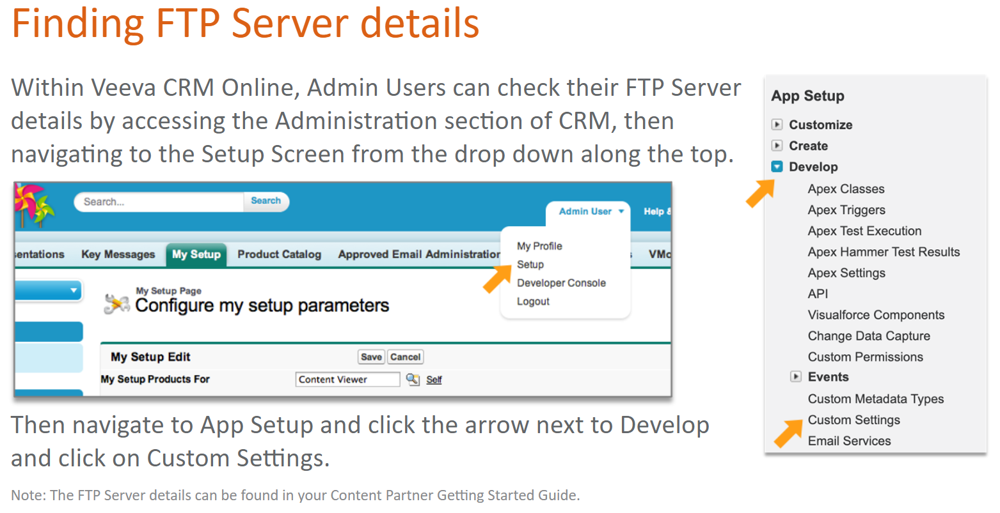
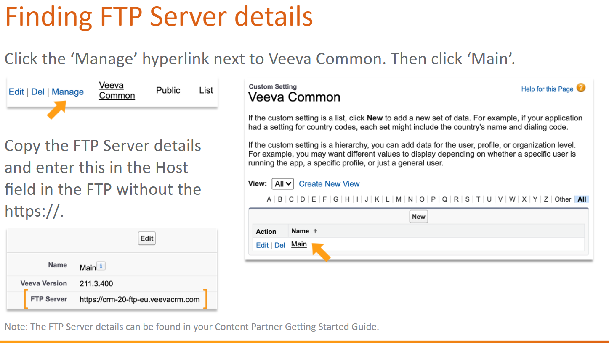

# Veeva CRM Content Administration

## Vault Packaging

After creating a piece of media for CLM, Content Creators must preapre it before uploading to Veeva CRM. This process has previously been covered for CLM content that is uploaded to Veeva Vault before being synced to Veeva CRM, using Vault Packaging format, an example of which can be seen below.

But what about the case where a Customer is not using Veeva Vault and CLM content must be uploaded directly into Veeva CRM instead?

This is where legacy Packaging is important. Overall, the preparation of media is quite similar to Vault Packaging, It still involves creating lower resolution versions of the media, putting all files into a folder, but in Legacy Packaging, the encapsulating folder must be compressed into a ZIP file.

## Legacy Packaging

Zip file requirements

- Each piece of media must be packaged in a ZIP file.
- Each ZIP file name in the systema must be unique.
- Uploading the same ZIP file name twice will overwrite the first one.
- The ZIP file name, excluding the .zip extension is the name of the media in the system.

Media Structure

- The files stored inside the ZIP file need to be contained in a folder with the same name as the ZIP file. File names are case sensitive.
- The file to be opened when the Rep selects a piece of media needs to have the same name as the ZIP, except fo the extension. For example, inside media1.zip is a folder media1 containing a file media1.jpg.
- Multiple files with this name (but with different extensions) within a ZIP file are not supported, as they system will not know which one to open.

Supporting Files

- Additional files, like images and stylesheets, should be included inside the folder or sub-folders and referenced using realtive paths.
- The thumbnail and full-screen are required for each piece of media.

Windows users must ensure that the ZIP file name does not exceed 260 characters, otherwise the file will not unzip properly.

## Content Creation in CRM

### Creating Key Messages

Login to Veeva CRM Online as an Admin User (e.g. cloader) and click on the 'Key Message' tab and click 'New' to upload a CLM Zip file.

Enter the name of the Key Message in the 'Message' field. Enter copy for 'Description' field (this text will appear underneath all thumbnails in Veeva CRM Mobile). Select the magnifting glass and search for the correct Product. Click 'Save' to save the metadata and be able to upload the ZIP file.

These instructions cover the essential fields for creating a Key Message, additional field e.g. Disabled Actions are covered in subsequent courses.

Once saved, the 'Upload' Button will appear to allow Content Creator to select the ZIP file from your local drive.

Click on the 'Upload' Link. Click 'Choose File' to select the relevant ZIP file. Then click 'Upload' to save the ZIP file to the Key Message record. This creates a Key Message record with attached CLM content. To add additional Key Messages, repeat this process.

## Creating a CLM Presentation

After creating all the Key Messages for a Presentation, navigate to the 'CLM Presentation' tab and click 'New' to create the CLM Presentation record.

Enter the name of the Presentation into the CLM Presentation Name field. Select the magnifying glass and search for the Product. Please not this should be the same as the Key Messages you previously created.

The click 'Save'.

### Linking CLM Presentations with Key Messages

Created in Veeva CRM Online in the previous steps are:

1. Key Messages which are the ZIP files or media.
2. The CLM Presentation ercord

In order to link the CLM Presentation record and each Key Message that can be shown by Reps during that Presentation, Content Creators must create CLM Presentation Slides.

### Creating CLM Presentation Slides

From the CLM Presentation record, scroll down the page to the CLM Presentation Slides display section and click 'New CLM Presentation Slide'.

The CLM Presentation Name will automatically populate. Select the magnifying glass next to the Key Message to search and select the desired Key Message. If required, enter the Display Order and click 'Save'.

- This is the order in which the Slide will display using the Native Swipe.

## FTP Upload

An FTP client can be used to upload multiple files at once or to upload files that are larger than 50MB, such as video files. This has the advantage of speeding up the process of uploading content directly into Veeva CRM and is similar to using Multichannel Loader in Vault. Content can be loaded using any FTP client (e.g., Filezilla or Cyberduck).

FTP loading only creates and/or updates key messages. The first time content is uploaded by FTP, the CLM Presentation and CLM Presentation Slides record will still need to be created as shown in earlier slides.

1. CLM ZIP files correctly packaged.
2. Veeva CRM Admin User e.g. cloader.
3. FTP Server details.
4. A Control File per ZIP file.

If creating additional users, the CRM Admin USer must have `Content_Admin_vod__c` field checked on the User page layout, reach out to your Program Manager if help is needed.




For each ZIP file that needs to be uploaded as a Key Message and individual Control File needs to created. The Control File needs to be created in one of the following encodings:

- ASCII
- ISO-8859-1
- UTF-8
- UTF-16
- UTF-32

Files may not contain any of the following special characters: ',/<>;:{}[]~!@$%*()=+

Control file:

```ctl
USER=<Veeva CRM User Name>
PASSWORD=<Veeva CRM Password>
FILENAME=<Filename.zip>
Name=<Name of Key Message>
Product_vod__c=<Salesforce ID of Product>
```

Open up the FTP client, enter the deatils:

- FTP Server Details into the Host field - remove https://
- Admin Username in Username field.
- Admin Password in Password field.

Click 'Quickconnect'

Drag and drop each .ctl file and the ZIP file in to the right-hand side of the server (Remote site). The FTP will show the number of files that are queued and the number of successful transfers. A message showing if the Key Message was uploaded successfully or unsuccessfully will be emailed to the email address of the CRM User.

## Content Migration

Once content is approved and verified in an agency sandbox, it often needs to be migrated for viewing in a customer sandbox by the brand team.

1. Select the CLM presentation to migrate and click 'Migrate'.
    - A unique Presentation ID is needed.
    - Only Approved and Active Key Messages and Presentations can be migrated to Production.

2. Clicking 'Migrate' will display the list of presentations, related slides, and Key Messages that will be migrated in one package at the same time.
    - Log in into the destination org
    - You will need login credentials yo your Customers CRM to be able to complete migration.

3. Review any error messages
    - Some errors may need to be resolved with the Customer and/or Services team.

Destination org now contains:

- CLM Presentation.
- CLM Presentation Slides.
- Key Messages.
- Attached Content.

Any record that exist in the destination org will be overwritten.
