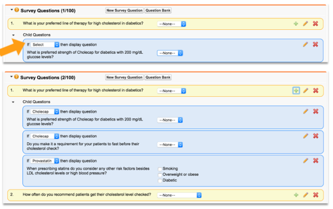

# Survey Basics

Suveys are a module in Veeva CRM which, when enabled, allows CRM Users to gather addition raliabble information about HCPs. Veeva CRM Modules are not separate products with a license cost but require Customers to configure and turn them on the be able to use.

Use cases:

- Gathering information for market research to help brand messaging and to allocate sales resources.
- Following up after an event.
- Understanding HCP treatment preferences.
- Evaulting speakers

## Whar are Surverys?

Surveys are a set of questions that Reps can ask HCPs and respond to in Veeva CRM.

- Reps can use it to help build useful Account profiles by better understanding the needs of their HCPs, as responses will be stored in the Survey Data fields to the CRM connected to the HCP Account.
- Marketing can also use surveys to collect information for building effective Key Messages.

Surveys are easy to design and deploy.

- Administrators configure and enable Survey functinality.
- Business Administrators can create and report on Surveys without the need for a System Administrator to be involved in the process.

In your Content Partner sandbox Surveys may have been configured by your Program Manager. Surveys need to be created in the customer's sandbox.

- Survey Creators - End Users/Business Admins who create, design and publish surveys.
- Reps - End users who administer the surveys for their HCPs.

## Types of Surveys

Surveys can be created for two different purposes:

1. Internal porpuses i.e., to gather feedback from Reps within the company.
    - There are called User Surveys.
    - To create specify the Record Type = User Survey.

2. External purposes i.e., to gather information from HCPs.

User Surveys may need to be configured, if needed speak yo your Program Manager.

## External Surveys

External Surveys are a way to gather more informatino from the HCP.

1. One-time Survey i.e., the HCP can only respond to the Survey once and therefore gathers a set of information only one time.

2. Recurring Surveys i.e., the Survey can be responded to by the same HCP multiple times, allowing the same set of questions to be answered by an HCP on a recurring basis. These Surveys maintain a history of responses, enabling Customers to track changes to answers over time.

## Survey Devices

Surveys can be accessed by Reps to complete with an HCP via Veeva CRM Mobiel (iPad and Windows), Veeva CRM iPhone application and Veeva CRM Online.

## Survey Channels

A Survey can be completed via:

- CRM: The rep can review or update the Survey on the device.
- CLM: The Survey can be accessed within the CLM presentation via Survey Overlay or integrated into the HTML.
- Approved Email: Reps can send an Approved Email to the HCP with a link to the Survey.

## Survey on Veeva CRM Mobile

Reps can review or update Survey responses (if the Survey is not ended) on each HCP Survey Targets page.

## Survey Overlay

Reps can also open a Survey from the Action Button using the feature Survey Overlay. Survey Overlay eliminates the need to navigate away from the presentation, complete a Survey and navigate back to the presentation.

## Survey integrated in CLM Presentations

Surveys can be accessed from CLM Presentations by utilizaing Veeva's JavaScript Library. Surveys integrated into CLM can be customized according the look and feel of the presentation.

## Surveys in Approved Email

Reps can send an Approved Email to the HCP with a link to the Survey which allows the HCP to respond to the Survey outside of the face-to-face interaction with the Rep. The Survey response is recorded and tracked in Veeva CRM against the Survey record.

## Survey Data Model Overview

The Survey Data Model Overview indicates where the information is stored in Veeva CRM when submitting a Survey,

## Survey Process

To create a Survey and make this available to be used in the field, there are 6 general steps that Content Creators or Admins need to complete:

1. Create Survey.
2. Add Questions.
3. Select Targets.
4. Publish Survey.
5. Create Responses.
6. Review Results.

## Creating a Survey

1. Login to Veeva CRM Online. Open 'Surveys' tab (if the tab is not visible, click '+' to see all tabs).
2. Click 'New',

3. Choose the relevant 'Survey Record Type':
    - One Time
    - Recurring
    - User Survey

4. Select 'Continue'.
5. Enter a name in the 'Survey Name' field.
6. Select a value from the 'Start Date' and 'End Date' fields, this controls how long the Survey is available for.
7. Select the 'Channels in which the survey will be published'.
8. Select the 'Assignment type', either 'Product and Territory' or 'Territory'. If product is selected then select the Product that this Survey will be associated to.

9. Select the 'Included User Territories' drop-down.
    - Select a least one territory from the drop-down list and select Insert Selected.
    - If the User creating the Survey only belongs to one territory this will auto-fill.

10. Select 'Save'.

11. Add questions. Choose the apporpieate formatting fot the question.
    - Picklist.
    - Text.
    - Radio.
    - Multiselect.
    - Number.
    - Date.
    - Date Time.
    - Long Text.
    - Description.

12. Select Targets.
    - Allows you to select specific HCP Accounts that this Survey is targeted for.

## Surveys in Vault PromoMats

The Survey record with a group of questions and information about the accounts si created in Veeva CRM. When the Survey is used vie the CLM or Approved Email channel, a corresponding record of this Survey must be created in Vault PromoMats.

The External ID field in Veeva CRM and Vault PromoMats must be the same.

The corresponding Survey record in Vault PromoMats needs to match the record created in Veeva CRM with the following fields:

- Survey Name.
- Start Date.
- End Date.
- External ID.

To create a Survey record, you must login with an Admin User and click on the 'Admin' cog button. Within the 'Business Admin' tab, there is a component object search box, click on this box and type in Surveys.

To create a new Survey, click the 'Create' button.

Enter the following fields to match the data in Veeva CRM:

- Survey Name.
- Start Date.
- End Date.
- External ID (this must match exactly and is case sensitive)

And click 'Save' button.

## Question Bank Options

The Question Bank is a list of reusable questions created for Surveys. Any questions created for a Survey can be added to the Questino Bank to be used on other Surveys in the future. Any time a User adds a question to a Survey, the 'Save' and 'Add to Question Bank' button displays, giving them the option to save the question for other Surveys.

When creating a Survey, the User has the option to create a Survey question or open the Question Bank. Selecting the Question Bank button opens the Question Bank screen. Users can select the check box beside any question and use the Add Selected button to add the questions to their Survey.

Survey in Veeva CRM can include:

- Picklist - up to 20 answer choices with a maximum of 200 characters.
- Radio - up to 20 answer choices with a maximum of 200 characters.
- Multi-select - up to 10 answer choices with a maximum of 200 characters.
- Number.
- Date.
- Datetime.
- Description - an open text field used for instructinos and notifications. No response is required.
- Text - maximum of 255 characters.
- Long text - maximum of 2500 characters.

Survey Creators can select if a question is required to be answered before the Survey can be submitted.

To create a new 'Survey Question' for a Survey, click the 'New Survey Question' button below the Survey record. Select the 'Type' and enter the question, answers choices (if appropriate).

The Required checkbox, if checked, will prevent the Survey from being saved without this question being answered. If more 'Answer Choices' are required, click the green '+' button.

To save the Survey, click 'Save' or 'Save and Add to Question Bank'.

## Survey Targets

In order to allow an Account to complete a Survey, a Survey Target needs to be created. When creating a Survey, the User can either pre-select the list of Survey Targets that can complete a Survey or allow Reps to add Survey Targets after the Survey is published.

To allow Reps to add a Survey target, the User ticks the 'Allow users to choose targets?' checkbox.

To pre-select the list of Survey Targets that can complete a Survey, scroll down the Survey Management page to the Survey Targets section and click 'New Survey Target'. Add all HCPs that should complete this survey.

## Survey Branching

Survey brancing is available vie the CRM and CLM channels for use on the iPad, iPhone and CRM Online platforms. Branching in Surveys allows for conditional questions based on previews answer choices.

Branching Surverys are not supported via Approved Email. Steps for creating Survey Branch questions are covered in Surveys in CLM.

- Users see each of the main line questions when Survey initially loads on the page.
- Once an answer for the parent question is selected the related children questions will also appear.
- If a child question is required, the validation to ensure the question is answered will only be enforced if the question is visible when the user submits the Survey.
- When Survey admins review the results only the questions that were displayed to the user during submission are included in the calculations.

Survey Branching can be utilized across survey types: One Time, Recurring and USer Surveys.

This is available for CRM and CLM channels only and is not supported for use in Approved Email. Brancing logic is preserved when cloning Surveys. Branching logic is copied to translated Surveys.

If a parent/child question is added to the Question Bank, the branching logic is not preserved in the Question Bank.

## Survey Publishing

Once the Survey is created, Surveys must be published in order to be available to complete.

First step is to click on the 'Publish' button. Publishing indicates a Survey is ready to be completed by Reps and HCPs. Publishing locks the Survey, restricting editing to Survey properties and questions.

## Survey for Internal Use

Customers are able to administer Surveys for feedback and analysis from internal users (employees). They are different compared to Surveys for external users, Survey Targets are Users (Reps) not Accounts (HCPs) and can automatically be created based on selected Territories and Products.

The User targeted for the Survey is also the owner. Internal Surveys in CLM are only available in training content on iPad (remember they activity is not tracked in training content).
