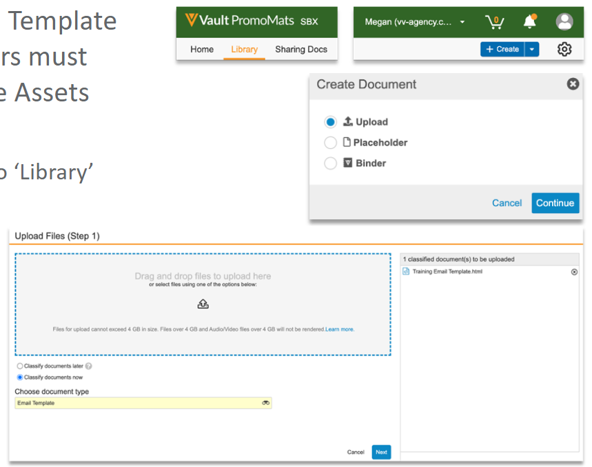
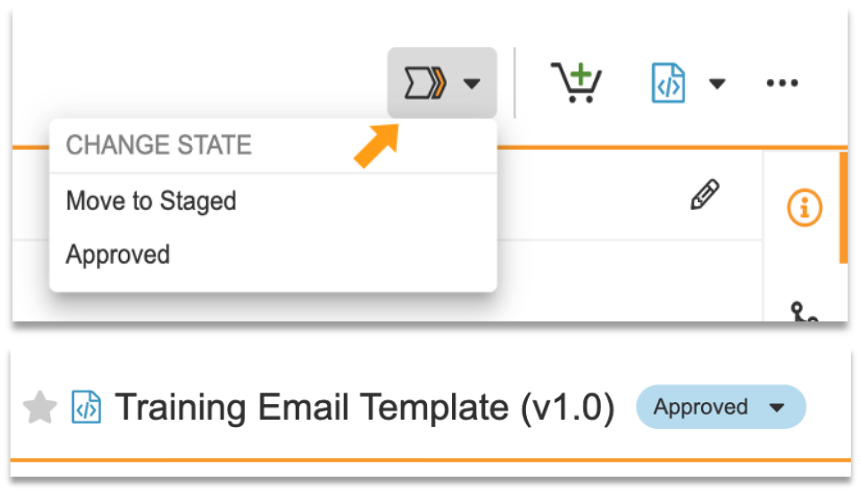

# Uploading and Syncing Email Templates

In orther to upload the Approved Email Template into Vault PromoMats, Content Creators must have an HTML file as well as separate Assets ZIP file containing the email images.

1. Login to Vault PromoMats and Navigate to 'Library'.
2. Click 'Create'.
3. Select 'Upload' and 'Continue'.
4. Upload the HTML source file.
5. Choose Email Template from the document type drop-down.
6. Click 'Next'.



Before the Email Template can be sabed, the required metadad fields need to be filled out. After filling out the required fields, click 'Save'.

- Name *
- Title
- Type
- Product *
- From Address *1
- From Name 2
- Subject *

The From and Reploy to fields can be hard-coded or dynamic using {{userEmailAddress}}1 and {{userName}}2 Tokens. The Subject field can be hard-coded or dynamic using Custom Text or Merge Tokens.

Once the Email Template has been created, the images need to be associated with the Template.

To add images, select the '+' in the Assets section in the Vault PromoMats metadata. Upload the Assets ZIP file. The path in the HTML should be like this:

```html


```

Once the Assets have been uploaded, the viewable rendition in Vault PromoMats will show the email HTML and images. If the images aren't rendering, It may need to re-render the document vie the Actions menu.

## Approving the Email Template

Before syncing Vault PromoMats and Veeva CRM, the Email Template must be set to Approved by clicking the Workflow and Change State menu adn selecting 'Approved'.



In Customer Environments, testing is usually done using the Staged State rather than Approved State. If the Email Template is in the Staged State, then this will only be available to Users with the 'Approved Email Admin' field checked on their User Record.

## Syncing CRM and Vault

Approved Email content is uploaded in Vault PromoMats and needs to be synced across to Veeva CRM to be accessible via Veeva CRM Online and Mobile.

Log into Veeva CRM as an Admin User (e.g. cloader) and click on the 'Approved Email Administration' tab. If the Approved Email Administration Tab isn't visible, all Tabs in Veeva CRM can be access via clicking the '+' button.

Select 'Incremental Refresh'. If successful, this will sync the Approved Email Template from Vault PromoMats into Veeva CRM making it available to be used.
