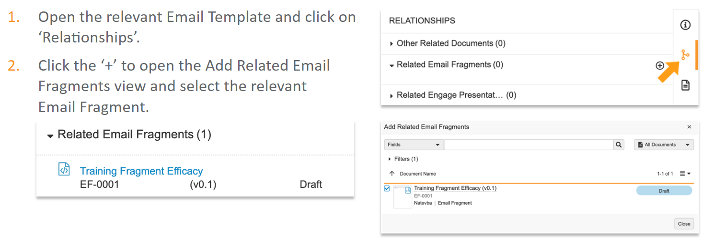
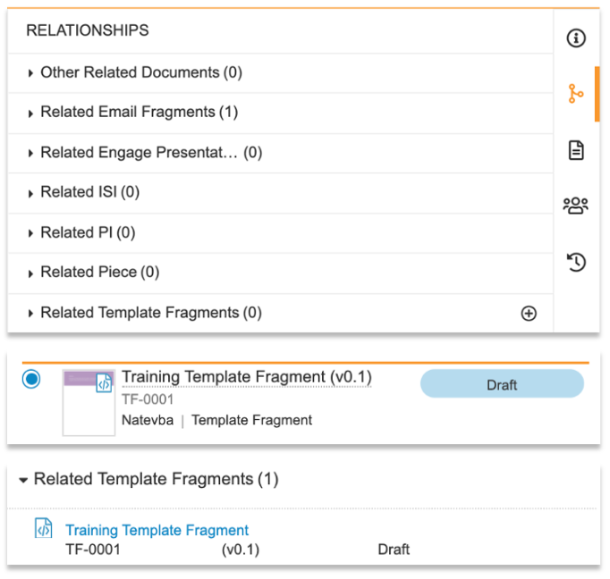
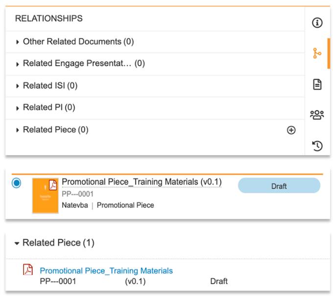

# Uploading and Syncing Email Fragments, Template Fragments and Document Types

In order to upload the Approved Fragment into Vault, Content Creators must have the HTML file and images in an Assets ZIP file.

1. Login to Vault PromoMats and Navigate to 'Library'.
2. Click 'Create'.
3. Select 'Upload' and 'Continue'.
4. Upload the HTML source file.
5. Choose **Email Fragment** from the document type drop-down.
6. Click 'Next'.


Before the Email Template can be saved, the required metadata fields (highlighted yellow) need to be filled out. Then click 'Save'.

- Name *
- Title
- Product *

Once the Email Fragments has been created, the images need to be associated with the Fragment.

To add images, select the '+' in the Assets section in the Vault metadata. Upload the Assets ZIP file. The path in the HTML should be like this:

```html


```

Once the Assets have been uploaded, the viewable rendition in Vault PromoMats will show the email HTML and images. If the images aren't rendering, It may need to re-render the document vie the Actions menu.

Once the Email Fragment has been created, it can be associated with the Email Template,

1. Open the relevant Email Template and click on 'Relationships'.
2. Click the '+' to open the Add Related Email Fragments view and select the relevant Email Fragment.



When a Fragment is associated with a Template, only the associated Fragment can be selected in that Template. If no Fragment is associated with the Template, all Fragments can be selected.

## Upload a Template Fragment

In order to upload the Template Fragment into Vault, Content Creators must have the HTML file and images in an Assets ZIP file.

1. Login to Vault PromoMats and Navigate to 'Library'.
2. Click 'Create'.
3. Select 'Upload' and 'Continue'.
4. Upload the HTML source file.
5. Choose **Template Fragment** from the document type drop-down.
6. Click 'Next'.


Before the Email Template can be saved, the required metadata fields (highlighted yellow) need to be filled out. Then click 'Save'.

- Name *
- Title
- Type
- Product *

Once the Template Fragments has been created, the images need to be associated with the Template.

To add images, select the '+' in the Assets section in the Vault metadata. Upload the Assets ZIP file. The path in the HTML should be like this:

```html

```

Once the Assets have been uploaded, the viewable rendition in Vault PromoMats will show the email HTML and images. If the images aren't rendering, It may need to re-render the document vie the Actions menu. Not all Template Fragments contain images

Once the Template Fragment has been created, it can be associated with the Email Template,

1. Open the relevant Email Template and click on 'Relationships'.
2. Click the '+' to open the Add Related Template Fragments view and select the relevant Template Fragment and click 'Save'.



When a Fragment is associated with a Template, only the associated Fragment can be selected in that Template. If no Fragment is associated with the Template, all Fragments can be selected.

## Upload a Document

In order to upload a Document into Vault, Content Creators must choose the Document type first.

1. Login to Vault PromoMats and Navigate to 'Library'.
2. Click 'Create'.
3. Select 'Upload' and 'Continue'.
4. Upload the Document.

5. Choose **the Document type** from the document type drop-down.
    - Reference Docuemnts (Important Safety Information or Prescribing Information)
    - Promotional Pieces

6. Click 'Next'.


Before the Email Template can be saved, the required metadata fields (highlighted yellow) need to be filled out. Then click 'Save'.

- Name *
- Title
- Type
- Product *

Once the Documents has been created, it needs to be associated with the Email Template or the Email Fragment,

1. Open the relevant Email Template or Email Fragment and click on 'Relationships'.
2. Click the '+' next to the relevant section to associate the document.



Remember to add the Vault Content Token in the HTML.

### Add ISI/PI Documents to Emailg Fragment/Email Template

The previews example shows the steps for a Promotional Piece document type using the Toke {{PieceLink}} in the HTML. The same steps apply for:

- Reference Document: Important Safety Information = {{ISILink}}
- Reference Document: Prescribing Information = {{PILink}}

When using the {{$VaultDocumentID}} Token, link the Other Related Documents with '+' to the Email Template or the Email Fragment. Remember to pull thos Document ID from the document's Vault URL.

## Approving Documents

Before syncing Vault PromoMats and Veeva CRM, the Email Fragment, Template Fragment and all documents must be set to Approved by clicking the Workflow Actions button and selecting 'Approbed' on each document type. In customer environments, testing is usually done using the Staged State rather than Approved State.

The workflow Action button will show a drop-down if there are multiple states to choose from. If your User only has permissions to one state, the the drop-down won't display and when the Workflow Action button is clicked will change the state.

## Syncing CRM and Vault

Approved Email content is uploaded in Vault and needs to be synced across to Veeva CRM to be accessible via Veeva CRM Online and iPad.

Log into Veeva CRM as an Admin User (e.g. cloader) and click on the 'Approved Email Administration' tab. If the Approved Email Administration Tab isn't visible, all Tabs in Veeva CRM can be access via clicking the '+' button.

Select 'Incremental Refresh'. If successful, this will sync the Documents from Vault into Veeva CRM making it available to be used.
