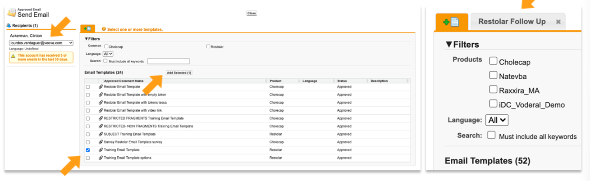
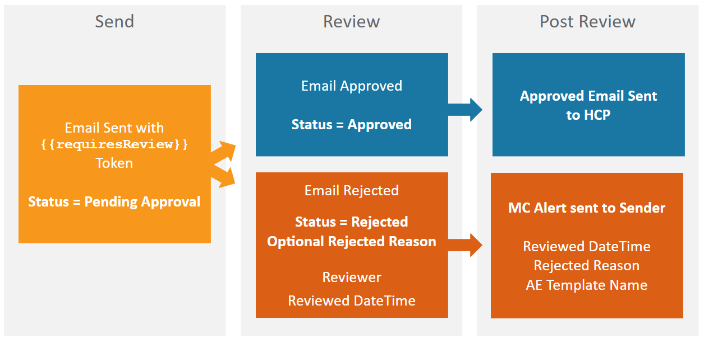

# Sending an Approved Email

## Veeva CRM Online

A Rep can send an Approved Email via Veeva CRM Online. Login to Veeva CRM Online:

1. Select 'Accounts' tab. If the Accounts tab is not visible click '+' button to view all tabs.
2. Select an account.
3. Click on 'Send Email' button.

Ensure the Account's Approved Email Consent is selected to 'Implicit Opt In'. The Send Email button opens a list of all available Email Templates.

1. Tick the checkbox to select the preferred Email Template and click 'Add Selected'.
2. Click on the Email Template box to open and send the Template.
3. Make sure the email assigned to the HCP is correct for testing.

To add related Email Fragments to the Email Template, click 'Add Documents', select the preferred Email Fragments and click 'Add Selected'.

Reps can preview the template before sending. Once the Approved Email is sent a success message will appear.

## Veeva CRM Mobile

In Veeva CRM Mobile, select an HCP Account, select the Action Button and click 'Send Email' to open up a list of available Email Templates.

From the 'My Accounts' page, the Rep can also send an email to up to 50 recipients at once, by opening the 'Table' view and selecting multiple HCP Accounts and clicking 'Send Email'.

To send an Approved Email, click on the Email Template. To open, click on the Email Template box that appears.

Once the Email template is selected, the user can add Email Fragments to the Email Template by selecting the paperclip icon.

To send an Approved email, swipe the 'Slide to Send' bar.

## Previewing Links in Approved Email Content

Approved Email users can select and view links generated from a Token while in Preview or Edit Mode. This enables users to verify that links in the template function correctly before the email is sent to recipients.

A new browser window opens displaying the web page when selecting a link in Preview or Edit Mode. Activity is not tracked on links selected in this modes.

Links generated by the following Tokens are now supported:

- {{Account.Id}}
- {{$VaultDocID}}
- {{AppDocID}}
- {{ISILink}}
- {{PieceLink}}
- {{PILink}}
- Any link generated using the {{ObjectAPIName.FieldAPIName}} format.
- Links to external sites

## Reviewing Approved Emails Before Sending

Approved Emails can be marked as requiring additional review before being sent to recipients by adding the {{requiresReview}} Token to the appropiate content.

This provides an additional level of compliance by enabling the final contents of an email to be reviewed and approved before it is sent to recipients.

Additionally, this feature can be used in other forms of Approved Email, for example, [Approved Email receipts for signature transactions](https://crmhelp.veeva.com/doc/Content/CRM_topics/Multichannel/ApprovedEmail/AdvFunct/EmailReceiptsforSignatureTransactions.htm) to hold sent emails until certain business conditions are met.

## Checking an Approved Email has been sent

### Approved Email sent in Veeva CRM Online

Go to Accounts in Veeva CRM Online and select an Account. On the Account Profile, scroll down to the Sent Email section. The Sent Email section shows 5 Sent Email records.

To view all records, click 'Go to List'. If more information is needed, click on the Sent Email Name.

Reps can seel all details from the Sent Email record:

- Name, Product, Sent Date, Status, Opens, Clicks, etc.

The details on each email activity can be reviewed by clicking on the Email Activity record. The Email Activity record from the Sent Email record will show the individual link that has been clicked.

Reps can also modify the Sent Email detail page layout and add Sent Documents, so Reps can visualize the Fragments sent in the email.

In case the Approved Email send has failed. Click on the Sent Email record and check the "Status Details" under "Status and Timeframe" section to help with troubleshooting.

### Approved Email sent in Veeva CRM Mobile

On the CRM Mobile application, navigate to 'My Accounts' and select an HCP Account. In order to see the emails details, click the 'Sent Email' tab on the left hand bar.

Reps can see the list of emails sent to the HCP. This list can be displayed by:

- Date
- Status
- Total opens, etc

Reps can also click into the details of an email sent and see additional information including:

- Product
- Delivered
- Opened
- Clicked, etc.

Reps can click the 'Email Activity' tab within the Sent Email record to visualize the activity in the links, this will show the URL of the document and the Rep can also view it.

Details on each email activity can be reviewed in the Email Activity record. The sent Email record will show the individual link that has been clicked.

## Stamping Fields on Sent Email

When an end user sends an Approved Email, the values of the Subject line of the email and free text or rich text entered by the sender are automatically stamped on the record populating the `Subject_vod` and `User_input_text_vod` fields.

This data is now stored distinctly and can be used to support a manual review process for complicance or an automated review in conjunction with Approved Notes rule. Data is easily available in standard reporting for analysis or extraction.

When an end user sneds an Approved Email, the `Subject_vod` and `User_input_text_vod` fields on the `Sent_Email_vod` object are automatically stamped and can be either manually reviewed or used in Creating Monitoring Rules.

Monitoring Rules define which fields are monitored and managed by Approved Notes.
