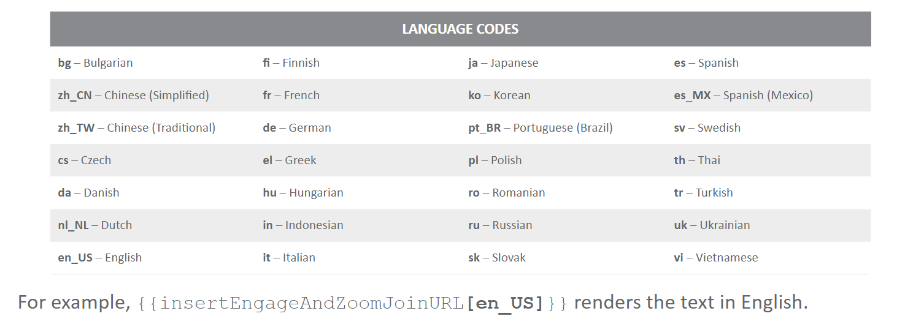

# Using Approved Email with Engage Meeting

The best way to invite an HCP to an Engage Meeting is by an Approved Email invitation. This email can provide the day and time of the meeting, enable the HCP to join the call by clicking on a unique Participant URL and add an .ICS file to allow the HCP to add this meeting to their calendar.

An Email Template is the only required component to send an Approved Email Engage Meeting Invitation.

In addition to the standard Approved Email Configuratin Tokens, there are Tokens that are specific to Engage Meeting that provide the HCP with the date and time of the meeting and details to join the meeting.

## Participant URL Token

Engage Meeting invitations should include the Participant URL, which will allow HCPs to seamlessly join an Engage Meeting from a unique link. The Participant URL can be added to the Email Template with the following Token:

- {{ Call2_vod__c.Cobrowse_URL_Participant_vod__c }}

## Date and Time Tokens

To include the Meeting Date and Time in an Engage Meeting Invitation, it is best to use the {{ parentCallDatetime }} Token. This ensures compatibility for both Person Account and Group Account Calls, as well as with the Token used for Calendar Reminders (covered on subsequent slide).

- Date and Time (Person Call) = {{ Call2_vod__c.Call_Datetime_vod__c }}
- Date and Time (Group Call) = {{ Call2_vod__c.Parent_Call_vod__r.Call_Datetime_vod__c }}
- Date only = {{ Call2_vod__c.Call_Date_vod__c }}

Beware that using {{ Call2_vod__c.Call_Datetime_vod__c }} or {{ Call2_vod__c.Parent_Call_vod__r.Call_Datetime_vod__c }} with {{ addToCalendar }} causes the date and time to display in Zulu format.

## Time Zone Tokens

Time Zone Tokens enable the time zome of the Rep, as specified in the CRM to be pulled into the Email Template. There are two versions that can be used.

- {{ timeZone }} = Renders in the email as the time zone abbreviation, e.g. GMT.

- {{ User.TimeZoneSidKey }} = Renders in the email as the location, description and time relative to GMT, e.f. (GMT +00:0) Greenwich Mean Time (Europe/London)

## Meeting ID and Meeting Password Tokens

Meeting ID and Meeting Password Tokens are used to display the unique meeting ID and password in an Approved Email Invitation.

- {{ Call2_vod__c.Veeva_Remote_Meeting_Id_vod__c }}
- {{ Call2_vod__c.Remote_Meeting_vod__r.Meeting_Password_vod__c }}

An HCP can type the unique ID and password in the Engage Meeting application when joining from a different device to the one where the email was viewed.

## Add to Calendar Token for Engage Meeting

Approved Email invitations allow HCPs to add the meeting to their calendars, setting a reminder for their Engage Meeting. To enable HCPs to access this reminder, the {{ addToCalendar }} Token must be placed in the HTML of the Email Template.

This Token automatically generates an .ICS file from the meeting details in CRM. We recommend that Email Templates include instructions on how HCPs can add the .ICS file event to their calendar.

{{ addToCalendar }} Token will not work in an Email Template if it is sent through the Veeva CRM Mobile Application on a Windows tablet. Engage Meetings can not be run from this applicatino, so this is no likely to occur in most use cases.

## Adding Dial-in Numbers to Engage Meeting Invitations

To make it easier for attendees to join the audio of an Engage Meeting via dial-in, Engage Meeting hosts can add dial-in numbers to invitations sent to attendees. This can be their preferred or required method of joining the meeting's audio. For dial-in numbers to display in invitations sent to attendees, content creators must add the {{ insertZoomDialInNumbers[Language Code] }} Token to the appropriate email templates.

The Token's [Language Code] parameter must be replaced with a supported language code, which determines the language of the rendered text.

In adition to the country defined in the user's `Country_Code_vod` field, additional countries can be added to a user to add the corresponding dial-in numbers to the invitation. This is especially useful if a user frequently hosts meetings in different countries.

## Adding the Zoom URL to Approved Email Templates

Content Creators can add the Zoom URL to Approved Email Invitation Templates by using the Token: {{ insertEngageAndZoomJoinUrl[Language Code] }}. In the BEE Editor, this Token can be found by navigating to Merge tags > Remote Meeting and Zoom Invite Lnks.



Given how the Zoom URL token behaves, it can be used in place of the following Engage Meeting-specific tokens:

- Meeting URL   = {{ Call2_vod__c.Cobrowse_URL_Participant_vod__c }}
- Meeting ID    = {{ Call2_vod__c.Veeva_Remote_Meeting_Id_vod__c }}
- Meeting URL   = {{ Call2_vod__c.Remote_Meeting_vod__r.Meeting_Password_vod__c }}

There are no equivalent tokens to only display the Zoom URL. The Zoom URL token must be used to display both the Engage Meeting Participant URL and Zoom URL. Therefore, Content Creator should also note that the Zoom URL token displays as strings of text, and these strings cannot be split up to edit the default text or put the Engage Meeting Participant URL and Zoom URL behind buttons.

## Uploading and Syncing Approved Emails

In orther to upload the Approved Email Template into Vault PromoMats, Content Creators must have an HTML file as well as separate Assets ZIP file containing the email images.

1. Login to Vault PromoMats and Navigate to 'Library'.
2. Click 'Create'.
3. Select 'Upload' and 'Continue'.
4. Upload the HTML source file.
5. Choose Email Template from the document type drop-down.
6. Click 'Next'.


Before the Email Template can be sabed, the required metadad fields need to be filled out. After filling out the required fields, click 'Save'.

- Name *
- Title
- Type
- Product *
- From Address *1
- From Name 2
- Subject *

The From and Reploy to fields can be hard-coded or dynamic using {{userEmailAddress}}1 and {{userName}}2 Tokens. The Subject field can be hard-coded or dynamic using Custom Text or Merge Tokens.

Once the Email Template has been created, the images need to be associated with the Template.

To add images, select the '+' in the Assets section in the Vault PromoMats metadata. Upload the Assets ZIP file. The path in the HTML should be like this:

```html


```

Once the Assets have been uploaded, the viewable rendition in Vault PromoMats will show the email HTML and images. If the images aren't rendering, It may need to re-render the document vie the Actions menu.
