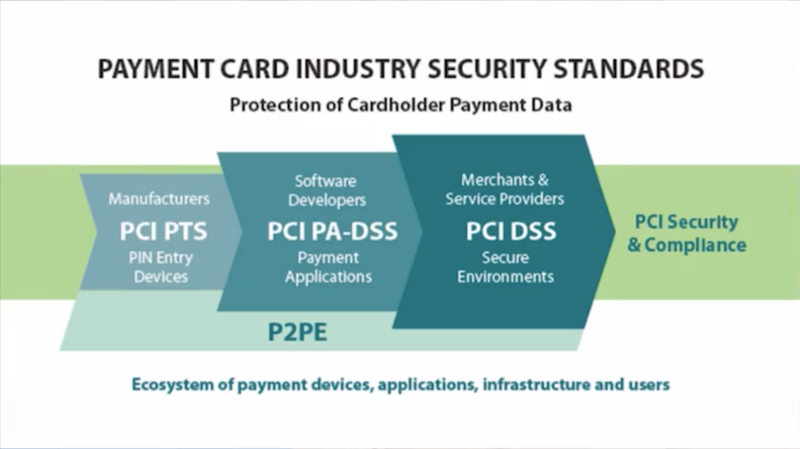
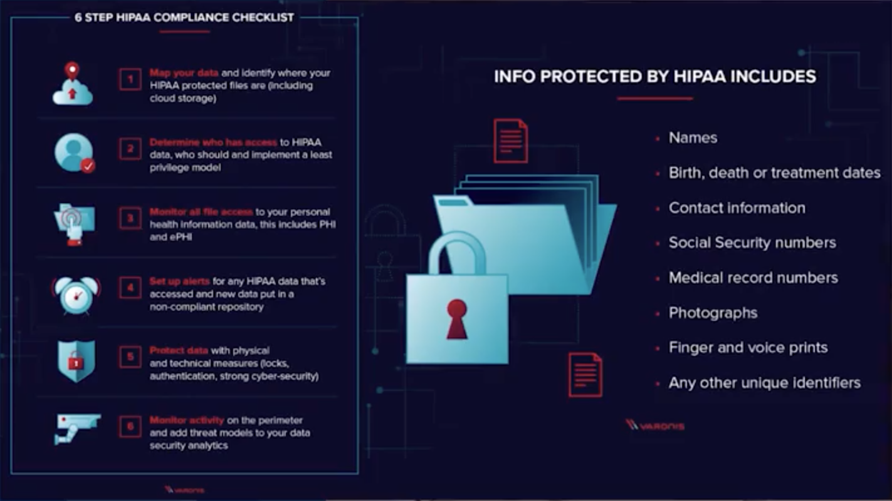
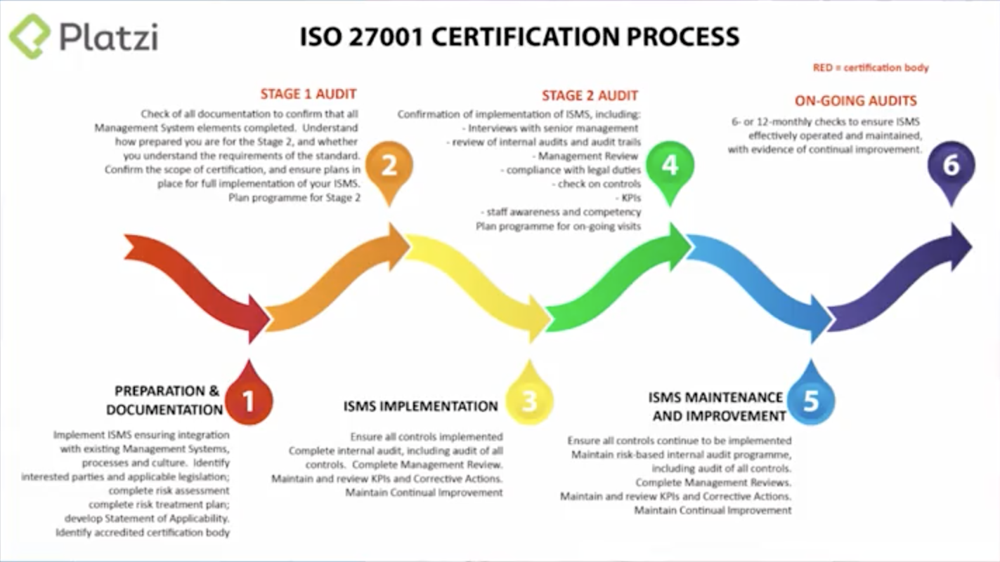

# Curso de Tecnología para Gerentes y Directores

## Software at the core

En el mundo moderno la tecnología mueve toda la industria y no es opcional no saber cómo está integrado.

Lengujes de programación para aplicaciones móviles:

- **Dispositivos iOS:** Objective-C, Swift.
- **Dispositivos Android:** Java, Kotlin.

Lenguajes de programación para desarrollo web:

- **HTML (Forma de Mostrar):** ORGANIZA, Determina la estructura de la informaciín.
- **CSS (Forma en que se ve);** APARIENCIA, Determina el diseño gráfico.
- **JavaScript (Forma en que se hace):** CÓDIGO, Determina toda la parte interactiva, funciones, acciones.

Estructura:

  1. **Desarrollo FRONTEND:** Lo que los usuarios ven y con lo que los usuarios interactúan.
  2. **Desarrollo BACKEND:** Controla el acceso, los permisos y la seguridad mediante la combinación de lenguajes de programación y librerías. Se asegura de que las personas correctas accedan a la información correcta.
  3. **DATOS:** Información de la empresa

[Extra Notes](https://static.platzi.com/media/public/uploads/curso-tecnologia-gerentes-1-16_f2ebaf8a-1862-4fbc-a199-d047c33977cf.pdf)

Al conocer y entender cada uno de los elementos podremos gestionar cualquier proyecto de TI e implementar de manera exitosa innovación dentro de nuestra empresa.

> "No necesitas tener conocimiento de ingeniería pero tienes que hablar el idioma de los ingenieros"
>

--

> "El software permite la mejora continua iterativa"
>

Los usuarios son la razón fundamental por la que construir software es diferente a construir un edificio.

Los usuarios entienden la aplicación de forma intuitiva, lo que permite evolucionar de acuerdo a las nuevas necesidades que se derivan de su uso. En este aspecto, tener la capacidad de adaptarse rápidamente al cambio y a las nuevas necesidades será la diferencia entre la continuidad de nuestra empresa y/o servicios en el mercado o su desaparición.

Es difícil aprender por experiencia propia cuál de las siguientes opciones escoger para nuestra empresa:

  1. ¿Cuando contratar proveedores externos?
  2. ¿Cuándo hacer el desarrollo in house?
  3. ¿Cuándo utilizar servicios ya construidos?

Y de esto dependerá la respuesta a la iteración del software de nuestra empresa.

> "El software es un jardín"
>

### Cómo contratar perfiles técnicos

Parte del problema de las empresas por contratar equipo tecnológico, es restringirse a un tipo de talento que realmente no existe en el mercado, o no necesariamente tiene una relación fuerte con su calidad.

El director de área define el filtro a través del cual va a definir cuales pasan o no a la entrevista. Es el director quien hace la primer entrevista, nunca recursos humanos.

Luego el equipo de area hace la prueba técnica, de lograrlo, esa prueba técnica define si la persona sabe o no sabe y esa prueba técnica es mucho más eficiente que cualquier otro potencial trabajo que el equipo de recursos humanos haga como filtro.

Cuando la prueba esta lista, el equipo de recursos humanos hace el feed cultural, el encaje en la empresa, etc, RH puede escribir el texto de la oferta, pero ésta debería ser escrita por el director del área.

Una buena prueba técnica prueba muy pocas cosas de una manera muy enfocada.

- Si tu prueba técnica es muy compleja y requiere más de un día de trabajo las personas no lo van a hacer y el buen talento te va a ignorar.
- Las herramientas tecnológicas que se decidió usar en la empresa, es lo que se tiene que probar, stack.
- Todas las personas especialistas en cualquier área, lo que mas hacen en el día es GOOGLEAR, no personas que se saben todo de memoria, sino personas que pueden construir soluciones.

[Extra Notes](https://static.platzi.com/media/public/uploads/curso-tecnologia-gerentes-70-93_db2ea563-98e4-4f2c-9f9d-7b2cbab27d7c.pdf)

Para construir una cultura con un ADN de software dentro de la empresa, sigue estas 6 reglas:

#### Regla 1

  1. Las personas en roles de TI son especiales (creativos).
  2. No pueden ser manejados por gerencia tradicional.
  3. No encajan en procesos rígidos.
  4. Transforman ideas en realidad.
  5. Piensan un producto con un valor hacia su existencia.
  6. Las interrupciones los matan (minimizar reuniones para este equipo). Cada interrupción a un ingeniero que está creando, puede costar de 1 a 2 horas de productividad al día.
  7. No encajan en una agenda de cumplimiento de horario específica.
  8. Son posiciones del más alto ROI (se alimentan de ideas y tiempo para crear proyectos y volverlos realidad).
  9. Pasa un 80% de su tiempo leyendo código para pasar el 20% restante creando código (estructuras de datos, flujos de información).

Cuatro grandes perfiles en los roles creativos:

1. **Vendedores:** hiper optimistas. "Todo es posible". Dan opciones poco realistas de cómo se puede lograr. Son poco pragmáticos y el hiper optimismo a veces ciega su capacidad de ejecución. Son extremadamente apasionados por la tecnología pero se vuelven peligrosos cuando les apasiona más la tecnología como tal que la solución (quieren volver a hacer todo desde cero, quieren probar las últimas tecnologías aunque no sean las correctas)
2. **Creadores:** quieren convertir ideas en realidad, quieren ser alimentados de la visión más grande y con esto se emocionan para crear las soluciones.
3. **Arrogantes:** casi siempre combinados con los perfiles magos. Se sienten indispensables, son intocables (porque manejan permisos y responsabilidades únicos)
4. **Magos:** pueden hacer lo que sea, solucionar los problemas más extraños que se puedan imaginar.

- Sin un análisis profundo, recomienda reconstruir el sistema porque eso está terrible.

Un buen ingeniero:

- Primero lee y luego escribe.
- Primero entiende y luego ejecuta.

Quédate con el talento positivo, que se apropie de los problemas, que quiera crear y hacer magia = quédate con las personas que tienen el perfil "creador" y "mago".

#### Regla 2

la cultura que se crea en los equipos de tecnología, tiene que recompensar una experimentación constante, crear cosas nuevas y capturar datos cuando un proceso falla. Lo más importante de fallar es documentar y aprender.

#### Regla 3

el diseño de los procesos debe permitir ese aprendizaje de errores. Experimentar, medir, iterar y evolucionar a través de una cultura de aprendizaje.

#### Regla 4

Todas las decisiones deberían usar herramientas digitales primero, para que ese ADN digital permee en la empresa

#### Regla 5

Tener una curiosidad implacable. Ganas constantes de estar probando cosas nuevas y siempre estar aprendiendo y experimentando.

#### Regla 6

Aunque la tecnología falle, o no se cumplan los tiempos de entrega; no olvidar el valor tan grande de las ideas y seguir persiguiéndolas para que ocurran. Una cultura determinada a nunca rendirse.

* * *

- ¿Cuándo vale la pena contrata un equipo interno o externo?
- ¿Cuándo vale la pena contratar un equipo que esta construido o construirlo para la empresa?

Pensemos en las 3 grandes categorías:

- **Servicios:** Todo el software que esta ahi afuera, usarlo e implementarlo.
- **Software interno:** El que creamos para usarlo nosotros y lo creamos con ingenieros y con un equipo que contratamos para nuestra empresa.
- **Software de terceros:** Otras personas lo hacen "third part".

Hay servicios que no necesariamente desarrollaremos en la vida y que deberíamos contratarlos:

- Un sistema operativo: Microsoft, Linux, Mac.
- Un cliente de correo: Outlook o Google Suite.
- Sistema de sincronización de trabajo remoto: Slack.
- Software de asdministración de manejo de proyectos: Trello.
- Sistema de soporte financiero: Excel.
- Powerpoint, Keynote para distribuir conocimiento.
- Dashboards: Hay empresas que desarrollan el DB de manera interna, otros contratan servicios u otros usan metabase, google data studio.
- Software típico corporativo: Salesforce, Siigo, Oracle Netsuite.

Las disrupciones son inesperadas. Para la disrupción del COVID19, las empresas de software fueron las que reacccionaron mejor.

3 componentes para tener en mente cuando construimos el software por nuestra cuenta o contratarlo por terceros:

1. Conocimiento interno estrategico.
2. Velocidad de iteracion, es decir, ¿cada cuánto cambia tu proceso?
3. Protección anti-disrupción, es muy difícil predecir la economía o las cosas terribles que pasan en la industria, hay que reaccionar rápido. Ser veloces al adaptarse a los cambios e innovando.

> La innovación en ocasiones no es tan dificil, sino, la iteracion rápida y la irrupción instantanea que son las que hacen la diferencia.
>

Al tomar la decisión de si contratar a alguien más para que construya una capacidad de tu negocio, o hacerlo internamente, o si la ventaja existe y hay que comprarlo, hay que analizar la situacion en la que nos encontamos:

- ¿Estamos creando una ventaja competitiva única para tu compañía? - Constrúyelo
- ¿Estamos creando una mejora iterativa que arregla algo que ya tenemos? - Delégalo
- ¿Estamos haciendo una automatización probada en un caso de estudio? - Cómpralo

La razón por la que las empresas tradicionales sufren de la disrupción de los mercados es porque no siempre están preparadas, porque asumen que su posición dominante va a protegerlas como empresas de cualquier disrupción.

La realidad es que las empresas que hacen lo más difícil primero, tienden a estar mejor preparadas a los cambios de mercado que las empresas que arrancan de a poquitos haciendo el camino de dominio.

Una de las condiciones más importante de implementar tecnología en tu empresa, es recordar que es difícil. Si es una ventaja competitiva que te pone por encima de tus competidores, no deberías contratar a terceros para que lo hagan por vos, si no hacerlo vos mismo.

## El ciclo del desarrollo de tecnología empresarial

La primer pregunta y la más importante para saber cómo abordar un problema en la empresa con innovación es: _¿Por qué?_

Cuando entiendes el ¿por qué?, tomas decisiones distintas.

- Escribir detalladamente las especificaciones del proyecto: razón por qué se hace y el alcance a dónde quiero llegar.
- Reunir a todos los interesados y conseguir el SÍ (firmado) de todos en la etapa de especificaciones. (el que paga, el que usa, el que hace el proyecto)
- Crear el boceto (mockup) = primera versión. Es la idea mental de cómo se va a ver; no cohibir la creatividad del equipo que lo convertirá en realidad.
- Crear un Wireframe = muestra la forma final de cómo se va a ver el proyecto. Es ambicioso y define el alcance del proyecto.

### Líderes técnicos

- **Stakeholder:** Es quien toma las decisiones de Dinero.
- **Product Manager:** Experto en tecnología, decide las bases del proyecto.
- **Product Owner:** Dueño del producto, conexión de negocio - desarrollo.
- **VP Engineering:** Sabe de Tecnología, genera rutas de crecimiento del equipo, recluta y retiene talento.
- **CTO:** Decisiones estratégicas de tecnología. (esta tecnología o esta otra?).

> Los grandes proyectos hace pequeñas mejoras iterativas (lanzamiento por etapas a través de A/B testing para medir la percepción de los usuarios).
>

--

> La tecnología se crea hablando con usuarios y creando productos.
>

--

> Es recomendable no lanzar un monolito, sino lanzar etapa por etapa.
>

### Roles en proyectos de Tecnología

### Métodologías de cumplimiento de fechas de entrega

- Nunca hacer muchos cambios de golpe.
- Tú no sabes lo que no sabes.
- Interacción continua (entrega pedacitos pequeños que son funciones independientes uno de otro)
- Medir resultados, Éxito vs. Fracaso.
- Se recomienda desarrollar en equipos pequeños en paralelo cada componente independiente.
- Los pequeños triunfos incrementan la moral del equipo.
- Recuerda estás creando algo que no existe.

### Líderes vs. Equipos

Un buen lider:

- Inspira compromiso para su equipo.
- Facilita la colaboración.
- Desarrolla a otros (Crecimiento).
- Hacer que las cosas pasen (Cumplir fechas).
- Absorde Incertidumbre.
- Persevera y Enfoca.

Equipos:

1. **Seguridad Psicológica:** Los miembros del equipo sienten seguridad para tomar riesgos y ser vulnerables en frente del resto.
2. **Seriedad y confianza:** Los miembros del equipo hacen que las cosas pasen a tiempo y con excelencia.
3. **Estructura y Calidad:** Cada miembro del equipo tiene su rol claro, planes y objetivos.
4. **Significado:** Lo que hace es importante para otros miembros del equipo.
5. **Impacto:** Los miembros del equipo saben que su trabajo importa y crea cambio.

### Cuánto pagar por un proyecto de tecnología

Hay tres formas de obtener los precios del mercado:

- **Benchmarks:** Cotizar con terceros.
- **RFPs:** Request for proposals o licitaciones.
- **Oportunidad:** Momento único en el mercado. El costo a analizar es lo que cuesta y lo que pierdas al no hacerlo.

* * *

- ¿Qué es lo peor que puede pasar?
- ¿Qué es lo mejor que puede pasar?

> Tiempo + Costo de la gente (\$) + Costo de la tecnología (\$) + Costo de la gestión (\$)
>

#### Reglas de la tecnología

1. Casi todos los precios en tecnología son imprecisos, optimistas y subvalorados
2. Casi todos los proyectos en tecnología que ocurren tienen un alto ROI
3. Todas las revoluciones de la historia han ocurrido gracias a la tecnología

> Crecimiento = Tecnología
>

## Seguridad Informática

La seguridad funciona como una cadena: son tan fuertes como su eslabón más débil.

Vivimos en un mundo donde nuestra civilización entera corre sobre software, sobre código.

### Ataque de Fuerza Bruta

Un ataque de fuerza bruta es un intento de averiguar una contraseña o un nombre de usuario, o de encontrar una página web oculta o la clave utilizada para cifrar un mensaje, mediante un enfoque de prueba y error, con la esperanza de acertar. i.e. Pin de 4 dígitos: 10 mil opciones de contraseña que se pueden hackear en segundos.

> Es muy importante tener contraseñas largas, para evitar que sean hackeadas rápidamente. Entre más larga, más combinaciones posibles y por tanto tomará más tiempo hackearla.
>

No usar la misma contraseña para múltiples servicios, pues los hacker pueden robar la información de éstos servicios y si ya tienen tu contraseña, te podrán hackear.

Lo correcto es tener:

- Una Contraseña maestra + Gestor de contraseñas
- Autenticación de doble factor: Algo que tu sabes (contraseña) + Algo que tu tienes (tocken, sms, google authenticator)

Si necesitas un nivel de seguridad más alto no es tan recomendable utilizar tu teléfono como 2FA (Two Factor Authentication), se recomienda las llaves de seguridad: _YubiKeys_

### Maneja de datos sensibles y encriptación

Es importante ecriptar los discos duros de todas las personas que trabajan con nosotros.

- En Windows es posible utilizando _BitLocker_
- En Mac es posible utilizando _FireVault_

**Dumpster Diving**: Consiste en recolectar datos importantes que fueron tirados a la basura en forma de documentos.

Si las reuniones son muy confidenciales lo más recomendable es utilizar una jaula de Faraday para tus dispositivos.

### Los NO rotundos de seguridad informática corporativa

- No enviar por medios digitales, tus Pasaporte, DNI, etc.
- Si tienes un Backups que no has probado, No tienes nada.
- WPA-2, wifi contraseña fuerte Solo permitir el acceso a los que tienen la MAC,
- Cero wifi, solo Ethernet.
- Tapa la webcam y el micrófono.
- No confieso lo en pentesting interno sino contrata a externo.
- No usar WhatsApp para comunicación corportativa.
- No usar email para comunicación interna (Slack o Microsoft Team).
- Documentacion interna: Notion.
- Comunicación real-time: Slack.
- No usar USB para transmisión de archivos.
- No usar la misma clave.
- Claves largas.
- Asume que te van a hackear.

### Niveles de permisos y manejos de información

Cuando un empleado se vaya debes de por lo menos tener una copia de sus archivos en el servidor.

- Bases de datos → Las manejan los programadores, y excel no es una DB.
- Excel + Word → Microsoft tiene una copia en servidor. Pero también sería bueno que uses la herramientas de google para que todos tengan acceso a los archivos.
- Email → Es importante entender que si un empleado al renunciar o irse sigue teniendo acceso al correo puede que se esté llevando secretos corporativos.
- Software privado → CRM ERP, SAP, Salesforce, Intranets.
- Código → Son las piezas internas de cómo funcionan las apps que creamos en nuestra empresa. Normalmente se usan GIt, CVS, SVN, Github, Gitlab.

Debes asegurarte que cuando una persona se vaya de tu empresa no tenga acceso a ninguno de los 5 puntos que acabamos de mencionar. Así tendrás una buena seguridad informática.

## Infraestructura avanzada de software en empresas

### Arquitectura de Bases de Datos

> Nunca debemos conectar una base de datos directamente a la aplicación, esto pondría en riesgo la seguridad de los datos.
>

- Regla #1 en base de datos, evitar la redundancia de datos
- Las relaciones entre tablas son la clave para eliminar la redundancia de los datos.

### Cómo se construye el Backend

El backend se comunica con la base de datos y realiza variados procesos entre los cuales están los conocidos como CRUD (Create, Read, Update, Delete). El usuario no tiene acceso directo a este backend, sino que la interfaz o aplicativo se comunica con el backend a través de un API (application programing interface) la que reconoce el login entregado y le da distintos accesos al usuario.

> Un Data Warehouse es un repositorio que captura los datos que genera una empresa de una manera homogénea y fiable.
>

### Qué es y cómo pagar la deuda técnica de una empresa

**Deuda técnica mala:** Deuda que hacia futuro pueden aniquilar el negocio.

Preguntar al equipo de ingeniería: "Esto que quieren cambiar ¿Afecta a los usuarios? - Sí o No?
Si no afecta los usuarios o si no hay cambio positivo, muy probablemente los ingenieros están pagando deuda técnica.

Los equipos de ingeniería aman optimizar y en ocasiones lo hacen probando cosas nuevas. Esto significa, que muchas veces van a tratar de venderte una mejor que realmente no afecta a los usuarios para nada; pero utilizan adjetivos que no significan nada: robusto, veloz, ágil.

**Hacer las preguntas clave:**

- Si nosotros no arreglamos esto, ¿en cuánto se va a volver un problema?
- Es importante mantener tracking de la deuda técnica, mantener un registro de dónde ocurre?
- La rápida iteración es mejor que tener un producto perfecto (mejora continua = constante iteración).

Es mejor que los usuarios me den feedback rápidamente, incluso cuando algo está roto, es mejor a tener el **producto ideal** que nadie ve nunca y que la luz nunca está ahí.

> El código se hace para mover el negocio.
>

--

> **El uso real de una aplicación es mucho más importante que una aplicación perfecta.**
>

### Infraestructura de Servidores

Es importante aclarar que no todos los servidores están conectados a internet; por seguridad, muy pocos se conectan a internet y el resto permanecen con acceso exclusivo en la red interna. Para acceder a éstos se puede utilizar VPN.

Servicios:

- **HTTP:** Hypertext Transfer Protocol (HTML, lenguaje que construye la web).
- **HTTPS:** Hypertext Transfer Protocol Security (agrega capa de seguridad e encriptación a los datos que intercambia).
- **FTP:** File Transfer Protocol. permite transferir archivos sin una interfaz gráfica.
- **SSH:** Secure Shell. Interfaz de texto que me permite controlar desde otra computadora un servidor. Conexión cifrada.

Servicios de correo electrónico:

- **SMTP:** Simple Mail Transfer Protocol - Envía los correos.
- **POP3:** Post Office Protocol - Recibe los correos y los almacena local, en el equipo del usuario final.
- **IMAP:** Internet Message Access Protocol - Almacena los mensajes en el servidor de correo.

Otros:

- **VPN:** Virtual Private Network. permite el acceso a la red interna de la oficina por internet
- **Firewall:** servicio que permite abrir y cerrar otros servicios y prohibir el acceso a atacantes o personas no autorizadas.

### Servidores básicos o locales

#### En la oficina

- PC _normal_ o _blade_.
- Linux / Windows / Mac.
- Una máquina "poderosa".
- _Always on_

Servicios locales:

- Remote Desktop
- VPN
- SSH
- Archivos compartidos
- WAN router

> Un servidor de oficina se cae cuando se va Internet, se va la elictricidad o falla el hardware
>

#### En un DataCenter

- Siempre son blades.
- Linux, UNIX, BSD, Windows.
- Construcción profesional.
- TODO es redundante, internet, electricidad, datos, seguridad física, aire.

Servicios:

- PCI Compliance - Datos de tarjetas de crédito.

- HIPAA Compliance - Datos médicos.

- ISO Security - Certificación de Seguridad [(ISO 27001)](https://www.iso.org/isoiec-27001-information-security.html).

Backups semi automáticos y discos redundantes.

> Un servidor de un datacenter se cae si hay un fallo nacional de la fibra óptica, un corte de energía masivo o una catastrofe local
>

#### En la nube

- No sabes dónde están.
- No sabes cómo están hechos.
- 100% Autónomos.
- 100% redundantes.

Servicios:

- Base de datos.
- HTTP.
- Transcoder.
- AI Services.

Son más costosos y menos preocupantes.

[Extracto Libro Vida 3.0](https://drive.google.com/file/d/1ET0AFjvsBga_NLCqf3RnRq5qV457nZic/view)

## Recursos Humanos y Gestión de Talento

> "En tecnología tu obtienes lo que pagas"
>

- [Estudio de Salarios SG 2017](https://sg.com.mx/buzz/reporte-salarios-y-mejores-empresas-2017)
- [Estudio de Salarios SG 2018](https://sg.com.mx/buzz/datos-previos-del-estudio-de-salarios-2018)
- [Estudio de Salarios SG 2019](https://sg.com.mx/revista/58/estudio-de-salarios-sg-2019)

Calculadora de Salarios - [EXCEL](https://static.platzi.com/media/public/uploads/salarios-latam_es_ba9a45dd-c2a8-4e57-9e68-27005b33f828.xlsx)

### Cómo motivar ingenieros y estructuras de compensación

Mantener un buen nivel de motivación en tu personal, ayudarlos a crecer y mejorarse para que "no se aburran" y no "te los roben".

También es importante saber hacer una introducción a tu nuevo personal y tener un ambiente no tóxico, importan más los resultados qué el "nivel" asignado en un sistema.
Tener cuidado con el reclutamiento.

### Organigrama de equipos de Ingeniería

